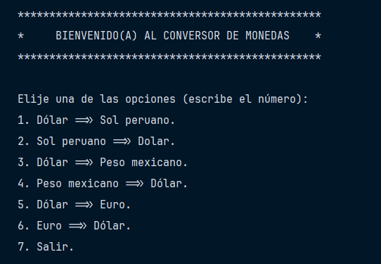
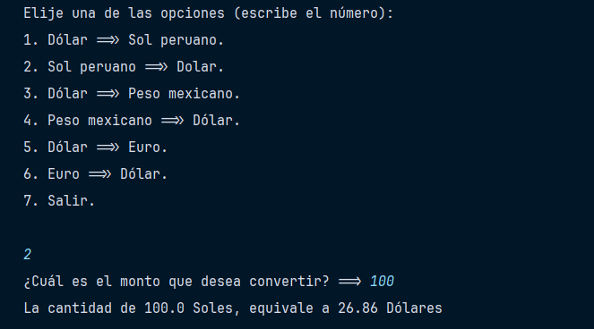
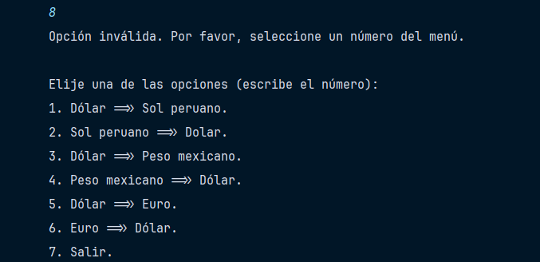
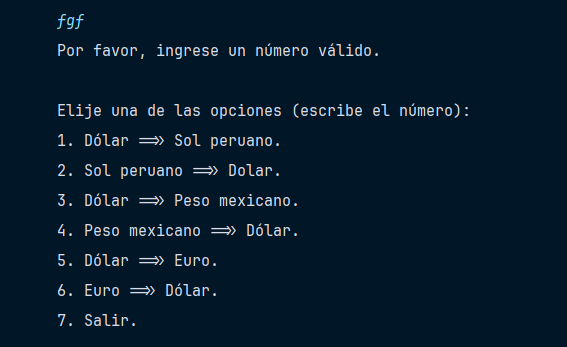
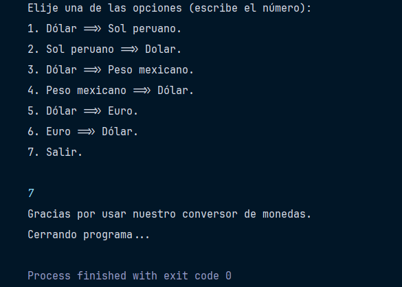

# Conversor de Monedas

Éste es un challenge de ONE (Oracle Next Education);
consiste en crear un conversor de monedas básico en Java, utilizando la API (exchangeRate-API).

## Requisitos
- Java 17 o superior
- Una clave de API de ExchangeRate-API (obtenla en https://www.exchangerate-api.com/)

## Uso
- Clona este repositorio en tu máquina local (lo encuentras en la rama master).
- Ingresa al archivo ConsultaMoneda.java
- Reemplaza YOUR-API-KEY en la URL de la API con tu clave de API de ExchangeRate-API.
- Ejecuta la aplicación.

## Ejemplo de ejecución:
1. El usuario ingresa por primera vez al programa.
   

3. El usuario ingresa una opción correcta.

4. El usuario ingresa una opción incorrecta.

5. El usuario ingresa un string u otro caracter.

6. El usuario desea salir del programa.

